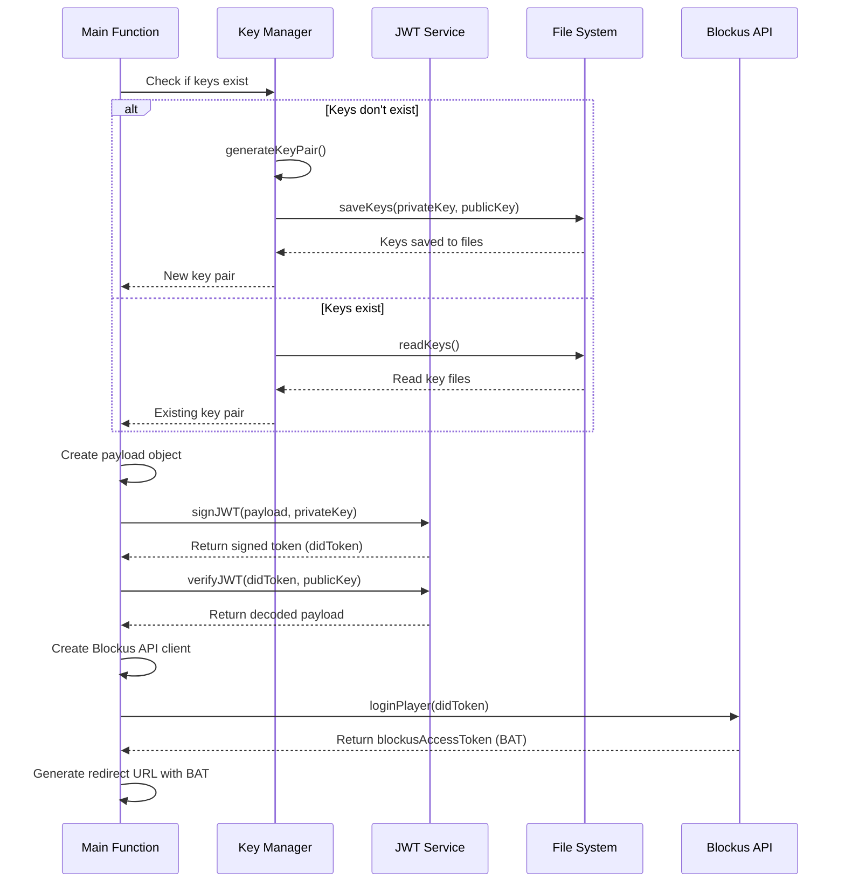

# Blockus API Secure Login

A secure and type-safe JWT (JSON Web Token) implementation using TypeScript and RSA cryptography.

## Features

- 🔐 Secure RSA key pair generation (2048-bit)
- 🔑 Key management (saving/loading keys from files)
- 📝 JWT signing with TypeScript type safety
- ✅ JWT verification with proper algorithm enforcement
- ⏱️ Token expiration management
- 🔄 Comprehensive error handling

## Prerequisites

- Node.js (v20.x or higher)
- pnpm

This project requires the following packages on your global machine:

```bash
npm install -g pnpm
```

## Installation

Clone the repository and install the dependencies:

```bash
git clone git@github.com:BlockUs0/auth-external-jwt.git
cd jwt-generator-ts
pnpm install
```

## Usage

```
pnpm demo
```

Demo command will run the function inside `src/demo.ts`
Inside the file you can study the usage of the API.

1. Generate a keypair for signing a jwt
2. Generate a jwt signed by your keypair with the required payload (iss, aud, sub)
3. Use Blockus SDK to login user and get the Blockus Access Token
4. Generate the redirect URL to link the wallet to the user

### Basic Example

```typescript
import { generateKeyPair, signJWT, verifyJWT } from "./jwt";

// Generate keys (or load existing ones)
const { privateKey, publicKey } = generateKeyPair();

// Create a payload
const payload = {
  userId: "user123",
  role: "admin",
};

// Sign a token
const token = signJWT(payload, privateKey);

// Verify a token
try {
  const decoded = verifyJWT(token, publicKey);
  console.log("Decoded payload:", decoded);
} catch (error) {
  console.error("Verification failed:", error);
}
```

### Complete Flow

The main function in the project demonstrates the complete flow:

1. Generate or load RSA key pair
2. Create a JWT payload
3. Sign the token with the private key
4. Verify the token with the public key
5. Demonstrate token expiration



## API Reference

### `generateKeyPair()`

Generates a new RSA key pair for JWT signing.

Returns: `{ privateKey: string, publicKey: string }`

### `saveKeys(privateKey: string, publicKey: string)`

Saves the key pair to files (`private.pem` and `public.pem`).

### `readKeys()`

Reads the key pair from files.

Returns: `{ privateKey: string, publicKey: string }`

### `signJWT(payload: TokenPayload, privateKey: string, expiresIn: number = 3600)`

Signs a JWT with the provided payload and private key.

Parameters:

- `payload`: The data to include in the token
- `privateKey`: The private key to sign with
- `expiresIn`: Token expiration time in seconds (default: 1 hour)

Returns: JWT string

### `verifyJWT(token: string, publicKey: string)`

Verifies a JWT using the public key.

Parameters:

- `token`: The JWT to verify
- `publicKey`: The public key to verify with

Returns: Decoded payload if valid, throws an error if invalid

## Security Considerations

- Keep your private key secure and never commit it to version control
- Use environment variables or a secure key management system for storing keys in production
- Set appropriate expiration times for your tokens
- Always verify tokens using the proper algorithm (RS256)

## License

[Apache License 2.0](LICENSE)

```
Copyright 2025 [Your Name/Organization]

Licensed under the Apache License, Version 2.0 (the "License");
you may not use this file except in compliance with the License.
You may obtain a copy of the License at

    http://www.apache.org/licenses/LICENSE-2.0

Unless required by applicable law or agreed to in writing, software
distributed under the License is distributed on an "AS IS" BASIS,
WITHOUT WARRANTIES OR CONDITIONS OF ANY KIND, either express or implied.
See the License for the specific language governing permissions and
limitations under the License.
```
