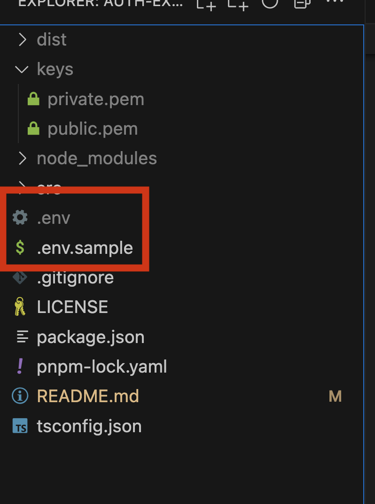
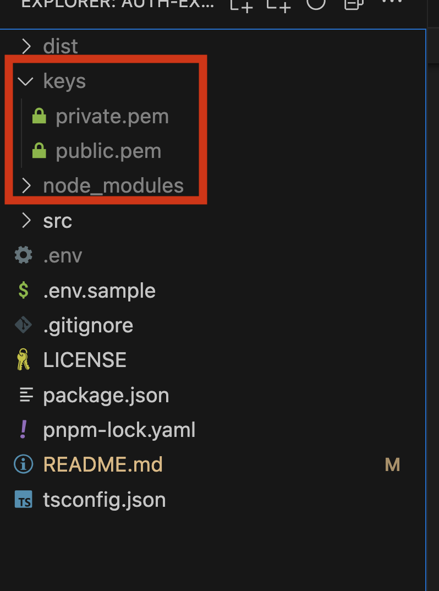
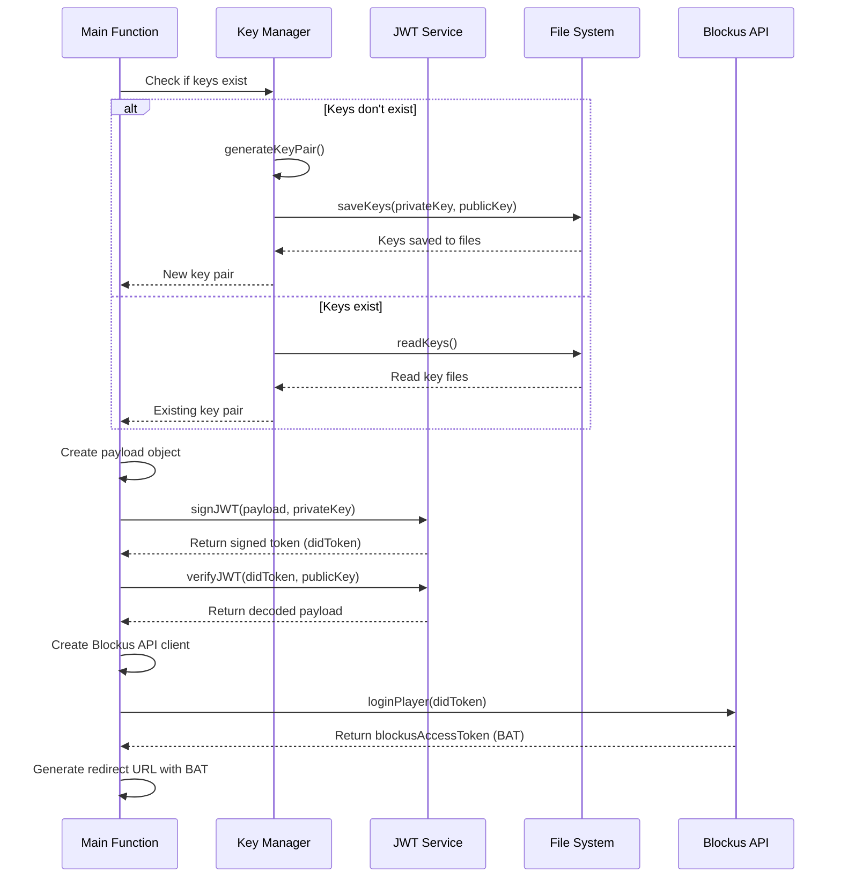

# Blockus API Secure Login

A secure and type-safe JWT (JSON Web Token) implementation using TypeScript and RSA cryptography.

## Features

- 🔐 Secure RSA key pair generation (2048-bit)
- 🔑 Key management (saving/loading keys from files)
- 📝 JWT signing with TypeScript type safety
- ✅ JWT verification with proper algorithm enforcement
- ⏱️ Token expiration management
- 🔄 Comprehensive error handling

## Prerequisites

- Node.js (v20.x or higher)
- pnpm

This project requires the following packages on your global machine:

```bash
npm install -g pnpm
```

## Setup Environment

Before starting the example, you need to create a `.env` file in the root folder. `.env.template` have a list of the required variables. Please modify the values accordingly to your account secrets from Developer's Portal.

<div style="max-width: 350px; margin: 0 auto;">
  
</div>

## Import existing keypair

The demo program will create a new keypair if the directory `keys` is empty.

If you have an existing keypair please import into the root directory.

1. Create a `keys` folder.
2. Create a `private.pem` file and paste the private key.
3. Create a `public.pem` file and paste public key.

<div style="max-width: 350px; margin: 0 auto;">
  
</div>

## Install dependencies

```
pnpm install
```

## Usage

The code inside `src/demo.ts` is intended to be implemented in your backend.

```
pnpm demo
```

Demo command will run the function inside `src/demo.ts`
Inside the file you can study the usage of the API.

1. Generate a keypair for signing a jwt
2. Generate a jwt signed by your keypair with the required payload (iss, aud, sub)
3. Use Blockus SDK to login user and get the Blockus Access Token
4. Generate the redirect URL to link the wallet to the user

### Adding a custom User Id

If you want to keep track of the user activities we recommend to register your players using your database user id so all the data and queries are tied to the same user and that improves observality and tracking.

The payload to sign will have all the required information. The value `sub` is the one you need to update in order to create a user with your database existing id.

```javascript
// Create a payload
const payload: TokenPayload = {
  sub: "0x01", // GAME DB USER ID
  iss: "iss", // ISSUER,
};
```

### Complete Flow

The main function in the project demonstrates the complete flow:

1. Generate or load RSA key pair
2. Create a JWT payload
3. Sign the token with the private key
4. Verify the token with the public key
5. Demonstrate token expiration



## Security Considerations

- Keep your private key secure and never commit it to version control
- Use environment variables or a secure key management system for storing keys in production
- Set appropriate expiration times for your tokens
- Always verify tokens using the proper algorithm (RS256)

## License

[Apache License 2.0](LICENSE)

```
Copyright 2025 [Your Name/Organization]

Licensed under the Apache License, Version 2.0 (the "License");
you may not use this file except in compliance with the License.
You may obtain a copy of the License at

    http://www.apache.org/licenses/LICENSE-2.0

Unless required by applicable law or agreed to in writing, software
distributed under the License is distributed on an "AS IS" BASIS,
WITHOUT WARRANTIES OR CONDITIONS OF ANY KIND, either express or implied.
See the License for the specific language governing permissions and
limitations under the License.
```
